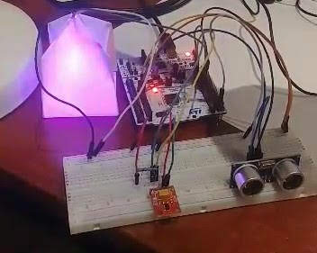

# PMIK SmartLamp

The Lamp is designed and developed In C on STM32, RGB LEDs, illuminance and distance sensors and controlled with computer using UART communication.
It can can work in three modes, that are chosen and configurated on the computer:
- **Rainbow** - the lamp smoothly passes through all the colors of the color palette, with the option of stopping the lamp on a given color by pressing the button,
- **Strobotron** - the lamp flashes with different colors of light, with a given frequency,
- **Color picker** - the lamp lights up in the color given in RGB format, a transition from the previous to the given color occurs smoothly at a specified time.

The **illuminance sensor** changes brightness of the lamp (if it is working in rainbow or strobotron mode) and the **distance sensor** stops current mode and turns the light off, if a user has left the room.

The lamp consists of the following modules:
- **STM32-NUCLEO** L476RG board
- Module with 7 sets of **RGB LEDs** with integrated **WS2812** driver (controlled using SPI)
- Illuminance sensor **APDS9930** (controlled using I2C)
- Distance sensor **HCSR04** (controlled using combination of timers and interrupts)
- **UART** communication with computer using dedicated python application
- Buttons and LEDs for debugging

